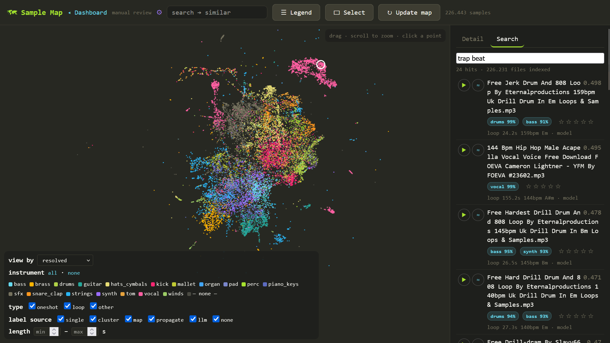
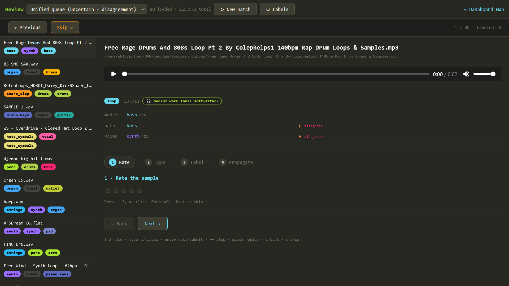

# Sample Tagger

A tool for automatically discovering, labeling, and clustering large collections of audio samples. The tagger extracts acoustic features, runs clustering, and provides a rich web interface for manual review, tagging, UMAP visualization, and natural language semantic search.



## Features
- **Discovery**: Fast concurrent scanning of large sample libraries (stat checks, metadata extraction).
- **Labeling Pipeline**: Extracts neural embeddings using PANNs (CNN14) and applies fast folder heuristics.
- **Machine Learning**: Trains a custom logistic regression classifier head on human judgments and applies it across the whole database.
- **Semantic Search**: Uses CLAP text-to-audio models for natural language queries like "warm analog bass" or "vinyl breakbeat."
- **Web UI**: Includes an interactive UMAP projection map, built-in media player, search results with inline rating, and task management.
- **REAPER Integration**: A dockable in-DAW panel (`reaper/`) for CLAP semantic search — preview hits and insert them at the edit cursor without leaving the DAW.

## Installation

You can install the package in editable mode:

```bash
pip install -e .
```

### Models

- **PANNs (CNN14)** — downloaded automatically on the first `sample-tagger label`
  run to `~/panns_data/` (~300 MB, fetched from
  [Zenodo](https://zenodo.org/records/3987831) by
  [panns_inference](https://github.com/qiuqiangkong/panns_inference)). No manual step.
- **CLAP** — manual download required: get
  [`music_audioset_epoch_15_esc_90.14.pt`](https://huggingface.co/lukewys/laion_clap/blob/main/music_audioset_epoch_15_esc_90.14.pt)
  (~2 GB) from the [LAION-CLAP checkpoint collection](https://huggingface.co/lukewys/laion_clap)
  and place it at `~/clap_ckpt/music_audioset_epoch_15_esc_90.14.pt`.
  Loaded via [LAION-AI/CLAP](https://github.com/LAION-AI/CLAP) (`HTSAT-base`, no fusion).

## Usage — from empty database to trained classifier

The stages below build on each other; run them in order for a new library.
All commands default to `./samples.db` (`--db` to override); the editable
taxonomy and ML parameters live in `labels.db` next to it.

### 1. Index the library

```bash
sample-tagger discover <path_to_samples>
```

Fast stat/metadata scan; registers every audio file. Resumable — re-run it
after adding new packs.

### 2. Analyze and embed

```bash
sample-tagger label -j 4
```

Decodes each file and writes duration, oneshot/loop detection, BPM/key,
path-based instrument priors, and 2048-d PANNs (CNN14) embeddings — the
acoustic features everything downstream (similarity, map, classifier) uses.
First run downloads the CNN14 checkpoint (~300 MB) to `~/panns_data/`.
Budget ~1 GB RAM per worker; this is the slow pass (hours for six-figure
libraries, especially on network/FUSE mounts).

### 3. CLAP embeddings (semantic search + best features)

```bash
sample-tagger-ml clap-embed samples.db --full
```

Embeds every file with CLAP and exports the sidecars (`samples.clap.npy` /
`.paths`) that power text search and the `concat` feature set. Also a long
full-library decode pass. Requires the CLAP checkpoint in `~/clap_ckpt/`
(see [Models](#models)).

### 4. Explore in the web dashboard

```bash
sample-tagger-web            # http://localhost:8765
```

UMAP map (`/map` — run "Update map" once to project), text search, review
queue, settings. Everything below can be driven from here.

### 5. Hand-label a seed set

The classifier trains on *your* labels, so it needs some truth first:

- On the **map** or **review** page, click a label to set the dominant
  instrument; shift+click toggles additional labels (multi-label sets are the
  training truth, top-1 columns are projections of them).
- The taxonomy is editable in-app (`labels.db` is the source of truth);
  labeling rules live in `docs/taxonomy.md`.
- A few hundred labels spread across classes is enough for a first model;
  quality beats quantity — see the propagation caveat below.



### 6. Freeze a gold evaluation set (recommended)

Use the gold panel on the **review** page to sample candidates and freeze a
held-out validation slice. Frozen files are excluded from training and give
you an honest macro-F1 per run (stored in the `metrics` table), so you can
tell whether more labeling/retraining actually helps.

### 7. Train

```bash
sample-tagger-ml pipeline samples.db     # = export → train → predict
```

Exports features + labels, trains one-vs-rest logistic regressions on the
embeddings (per-class calibrated thresholds), and writes predictions back to
the DB (`model_labels` set + `model_instrument`/`model_conf` top-1). Also
launchable from the web UI. Individual steps are available as
`sample-tagger-ml export|train|predict`, and `clap-eval` benchmarks CLAP
zero-shot against the trained head on the gold set.

ML parameters live in the `ml_params` table of `labels.db` (values are
JSON-encoded). The most important one is the feature set:

```bash
# panns (default) | clap | concat — concat[PANNs|CLAP] scores best
sqlite3 labels.db "UPDATE ml_params SET value='\"concat\"' WHERE key='feature_model'"
```

`concat` requires steps 2 **and** 3 to be complete.

### 8. Iterate

Retraining is cheap (minutes, no audio decoding). Loop:

1. Review page → "disagree" queue surfaces samples where the model and
   heuristics conflict — label the ones the model gets wrong.
2. `sample-tagger-ml pipeline samples.db`
3. Compare gold macro-F1 against the previous run.

Caveat from experience: bulk-propagating labels across confusable class
boundaries (snare vs clap, synth vs pad) injects correlated noise and can
*lower* the score — prefer fewer, certain, hand-checked labels.

### Similarity from the CLI

```bash
sample-tagger sim "path/or/filename-substring.wav" -k 20
```

### Web Dashboard
To view the map, search semantically, manually review classifications, and control the pipeline:

```bash
# Start the web UI server on port 8765
sample-tagger-web
```

### REAPER Panel

`reaper/sampletagger_search.lua` is a ReaScript that talks to the running web
server: type a query ("dusty vinyl breakbeat"), click a hit to preview it
(optionally loudness-normalized), double-click to insert it at the edit cursor.
Also does acoustic "more like this" (`Similar`), pagination, and client-side
instrument/type/duration filters.

Requirements on the DAW machine: [ReaImGui](https://github.com/cfillion/reaimgui)
and [SWS](https://www.sws-extension.org/) (both via ReaPack), plus `curl` in
PATH (ships with Windows 10+/macOS).

Setup:
1. Copy the `reaper/` folder to the DAW machine (both `.lua` files must stay together).
2. REAPER → Actions → New action → Load ReaScript → `sampletagger_search.lua`, then dock the window.
3. Click ⚙ and set the server URL. File access:
   - `download` (default) — samples are fetched over HTTP into `<REAPER resource>/SampleTagger/cache/`.
   - `direct` — if the DAW machine has the same sample library mounted, set the
     remote/local prefixes (e.g. `/home/user/pcloud/DAW/Samples` → `P:\DAW\Samples`)
     and inserts reference the mount directly.

Config persists in `<REAPER resource>/SampleTagger/config.json`. Note: the first
search after a server restart takes a few seconds while the CLAP model loads.
